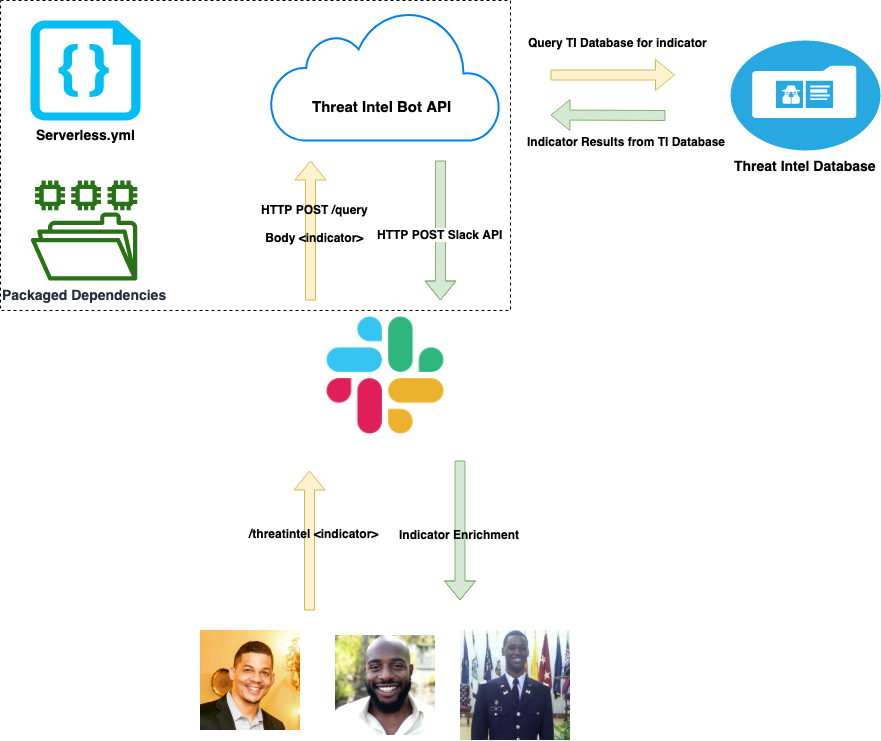

# Threat Intelligence Slack Bot

## Motivation

As organizations mature and scale their security infrastructure, it's vital that analysts, engineers, and other team members are able to query and enrich data on demand. Additionally, application features are being introduced at an increasing rate, creating the need for software defined infrastructure. In this project, we'll be exploring scaling automation efforts - with a focus on Threat Intelligence. This project can serve as a guide for when to leverage an interactive bot, creating API endpoints, serverless architecture, and applying actionable threat intelligence.

## Video Write-Up

https://www.youtube.com/watch?v=g40LLgYK1uM

# Architecture Overview



Threat Intel Slack Bot is completely serverless, and is built and deployed using Serverless.js.

There are three [Lambdas](https://aws.amazon.com/lambda/) controlling the process:

- `slashmessage`: Function to serve as API Gateway and facilitate execution of cloud functions to query Threat Intelligence databases
- `passivetotal`: Triggers indicator query (Domain Names only) to Passive Total and return response to Slack Channel
- `virustotal`: Triggers indicator query to VirusTotal and return response to Slack Channel

## One Command Deploy

`serverless deploy`

## Environment Variables

When deploying Threat Intel Slack Bot, `serverless.yml` defines the environment variables that will be passed to lambda functions.

`SLACK_API_TOKEN`

`VIRUSTOTAL_API_KEY`

`PASSIVETOTAL_USERNAME`

`PASSIVETOTAL_APIKEY`

```
export SLACK_API_TOKEN=<SLACK API KEY>
export VIRUSTOTAL_API_KEY=<VIRUSTOTAL API KEY>
export PASSIVETOTAL_USERNAME=<PASSIVETOTAL API USERNAME>
export PASSIVETOTAL_APIKEY=<PASSIVE TOTAL API KEY>
```

## Quick Start to Creating A Threat Intel Bot

1. Clone Threat-Intel-Slack-Bot
   - `git clone https://github.com/secdevopsai/Threat-Intel-Slack-Bot.git`
2. `cd threat-intel-slack-bot`
3. Install NodeJS
   -https://nodejs.org/en/download/
4. Install Serverless
   - sudo npm install -g serverless
5. Install Serverless Python Requirements Plugin
   - serverless plugin install -n serverless-python-requirements
6. Configure AWS Account
   - (https://www.youtube.com/watch?v=KngM5bfpttAhttps://www.youtube.com/watch?v=KngM5bfpttA)
7. Install Docker
   - https://hub.docker.com/?overlay=onboarding
8. Create Slack Workspace
   - https://slack.com/create
9.  Create Slack App
    - https://api.slack.com/apps
10. Deploy
    - `serverless deploy`
